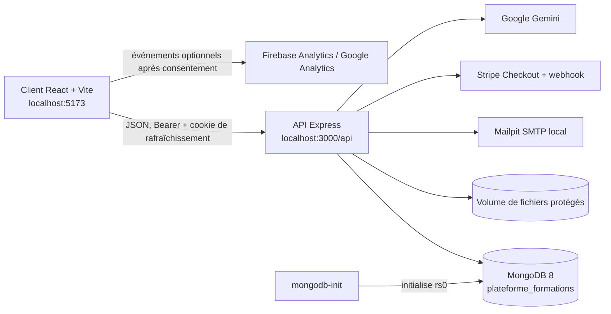
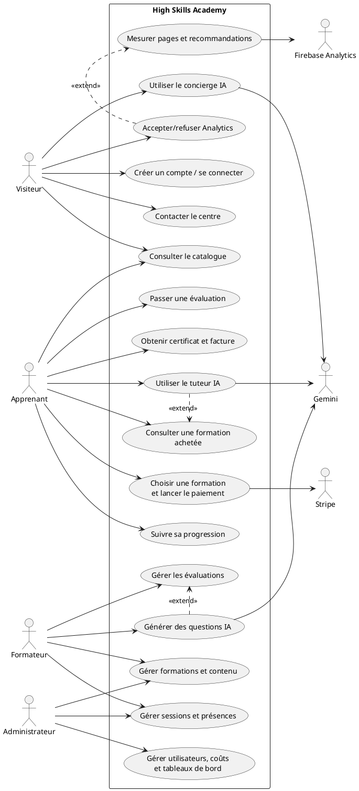
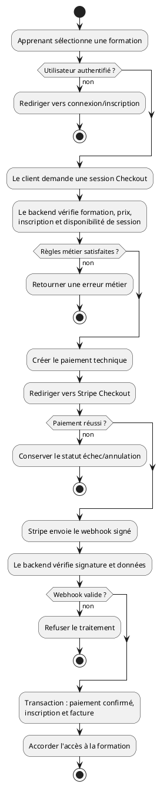
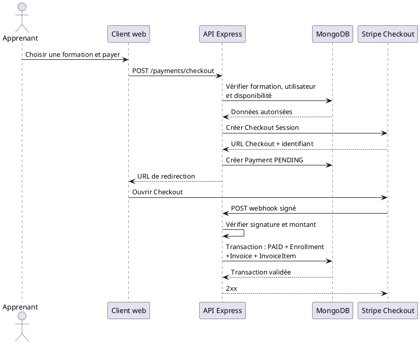
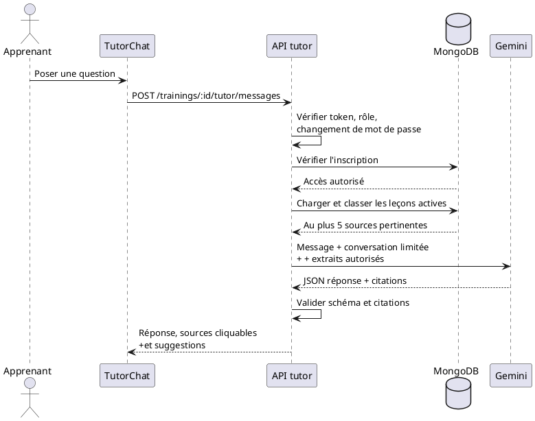
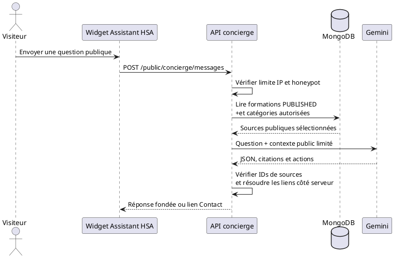
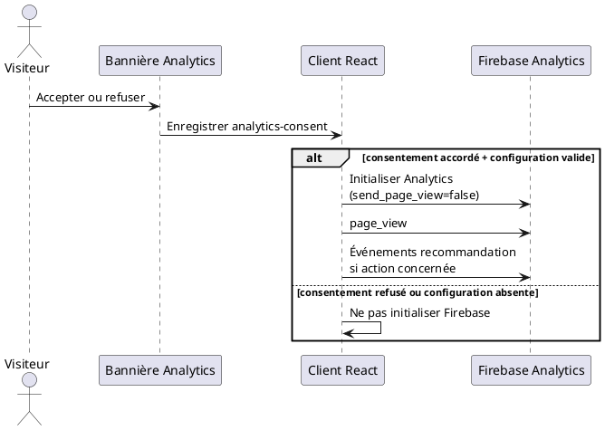
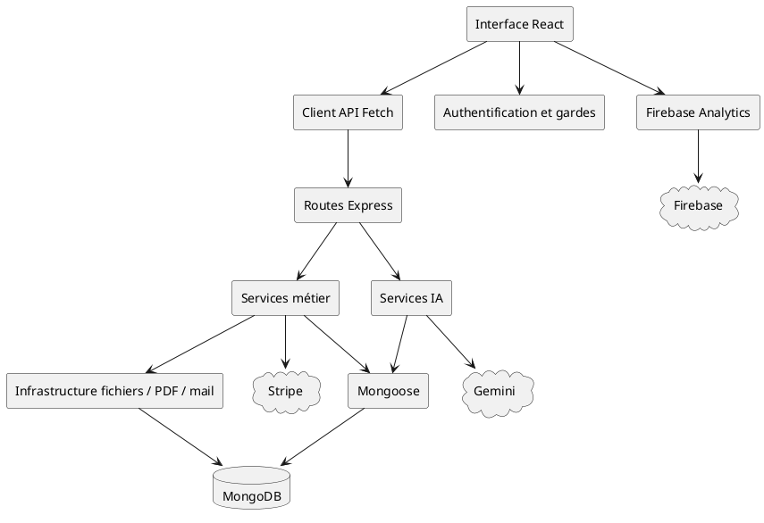

# High Skills Academy

## Rapport académique de projet — version définitive

> **Document de travail pour un mémoire de master**  
> Étudiant·e : **[à compléter]**  
> Encadrant·e : **[à compléter]**  
> Établissement : **[à compléter]**  
> Année universitaire : **[à compléter]**

---

## Résumé

High Skills Academy est une plateforme web de gestion de formations professionnelles. Elle centralise la publication des offres, les inscriptions, les paiements, l'accès au contenu, les sessions présentielles, le suivi pédagogique, les évaluations, la certification et les indicateurs de gestion.

Le projet répond au problème de la fragmentation des opérations d'un centre de formation entre outils de bureautique, échanges manuels, plateformes de paiement et documents isolés. La solution propose une application web structurée autour d'une API sécurisée, d'une base MongoDB et de services externes sélectionnés : Stripe pour le paiement, Gemini pour des fonctionnalités d'assistance intelligente et Firebase Analytics pour une mesure optionnelle du produit.

L'architecture retenue est un monolithe modulaire : les domaines métier sont séparés dans le code, tout en restant déployés dans une seule API. Une attention particulière est portée à l'autorisation serveur, à la traçabilité des paiements, à la protection des fichiers, à la limitation des appels IA et au consentement analytique.

**Mots-clés :** plateforme de formation, application web, monolithe modulaire, MongoDB, paiement en ligne, intelligence artificielle générative, Firebase Analytics, sécurité applicative.

## Abstract

High Skills Academy is a web platform for professional training management. It centralizes course publication, enrollment, payment, content access, in-person sessions, learning tracking, assessment, certification, and management indicators.

The project addresses the fragmentation of training-centre operations across spreadsheets, manual communication, payment tools, and isolated documents. The proposed solution relies on a secured web API, MongoDB, and selected external services: Stripe for payment, Gemini for intelligent assistance, and Firebase Analytics for optional product measurement.

The system follows a modular-monolith architecture: business domains are separated in code while remaining deployed in a single API. Server-side authorization, payment traceability, file protection, AI request control, and analytics consent are key design concerns.

**Keywords:** training platform, web application, modular monolith, MongoDB, online payment, generative AI, Firebase Analytics, application security.

---

## 1. Introduction générale

### 1.1 Contexte et problématique

Les centres de formation doivent coordonner plusieurs activités liées : présenter leur offre, gérer les comptes, proposer des contenus, organiser les sessions, suivre les apprenants, encaisser les paiements, produire des documents et analyser l'activité. Lorsque ces opérations sont réparties entre tableurs, e-mails, documents et outils indépendants, les données sont dupliquées, les règles d'accès sont difficiles à appliquer et le suivi devient fragile.

La problématique retenue est donc la suivante :

> Comment concevoir une plateforme web unifiée permettant de gérer le cycle de vie d'une formation, tout en protégeant les données, en garantissant l'accès après paiement et en intégrant des fonctions d'intelligence artificielle de manière contrôlée ?

### 1.2 Objectifs

L'objectif général est de mettre à disposition un système de gestion de formation cohérent et sécurisé. Les objectifs spécifiques sont les suivants :

- fournir un catalogue public de formations et un parcours d'inscription;
- distinguer les responsabilités des Apprenants, Formateurs et Administrateurs;
- organiser les contenus, les sessions, la présence et la progression;
- relier l'accès à une confirmation de paiement côté serveur;
- prendre en charge l'évaluation, la certification, la facture et le feedback;
- proposer des tableaux de bord basés sur des données métier persistées;
- intégrer une IA fondée sur des sources explicitement autorisées;
- mesurer l'usage du produit avec consentement explicite.

### 1.3 Démarche de conception

Le projet a été conçu en partant des règles métier à faire respecter par le backend : rôles, propriété d'une formation, accès par inscription, cycle de vie des entités, capacité des sessions et effets d'un paiement confirmé. L'interface web expose ensuite ces règles sous forme de parcours adaptés aux rôles.

Les fonctionnalités IA et Analytics ont été ajoutées selon le même principe : le serveur ou le client ne collecte et ne transmet que les informations nécessaires, avec des limites de taille, de fréquence ou de consentement adaptées au contexte.

## 2. Analyse fonctionnelle

### 2.1 Acteurs

| Acteur | Responsabilités dans le système |
| --- | --- |
| Administrateur | Utilisateurs, formateurs, catégories, formations, coûts, données financières, certificats, feedbacks et tableaux de bord |
| Formateur | Formations dont il est propriétaire, contenu, sessions autorisées, présences et évaluations |
| Apprenant | Catalogue, achat, accès aux formations payées, progression, présence, évaluations, factures, certificats et feedback |
| Visiteur | Consultation du site public et utilisation du concierge IA public |

L'inscription publique crée uniquement un compte Apprenant. Les Formateurs sont créés par l'Administrateur, tandis que le premier Administrateur est créé par un script idempotent. Les autorisations ne dépendent pas seulement du rôle : le backend contrôle aussi l'état du compte, la propriété, l'affectation à une session et l'inscription à la formation.

### 2.2 Cycle de vie d'une formation

```text
Création et préparation
        ↓
Formation DRAFT
        ↓
Publication dans le catalogue
        ↓
Paiement Stripe confirmé par webhook
        ↓
Création de l'inscription et accès contrôlé
        ↓
Progression ou présence, puis évaluation
        ↓
Certificat éligible, facture et feedback
```

Une formation suit les états `DRAFT`, `PUBLISHED` et `ARCHIVED`. Seules les formations publiées sont visibles publiquement. Une formation à suivre à son rythme doit posséder du contenu actif avant publication; une formation en présentiel peut être publiée avant la création d'une session.

### 2.3 Fonctions réalisées

| Domaine | Éléments principaux |
| --- | --- |
| Catalogue et comptes | Catalogue filtrable, fiches de formation, inscription, connexion, réinitialisation et profil |
| Offre pédagogique | Catégories, ownership, modules, leçons, ressources, publication et archivage |
| Parcours en ligne | Progression par leçon et accès après inscription confirmée |
| Présentiel | Sessions, plannings, capacité, affectations, présence et règles de chevauchement |
| Évaluations | Questions objectives, tentatives, correction automatique, résultats et désignation certifiante |
| Paiement et documents | Stripe Checkout de test, webhook vérifié, inscriptions, factures et certificats PDF protégés |
| Gestion | Coûts, satisfaction, revenus, résultat et rentabilité dans les tableaux de bord |
| Intelligence artificielle | Tuteur de formation, concierge public, génération de questions brouillon |
| Mesure | Firebase Analytics optionnel pour les pages et recommandations |

## 3. Conception architecturale

### 3.1 Choix architectural

L'application adopte une architecture de **monolithe modulaire**. Elle ne constitue pas un système de microservices : l'API Express porte les différents domaines fonctionnels dans un unique processus, mais chaque domaine est séparé par ses routes, services, modèles et objets de transfert.

Ce choix est adapté au périmètre du projet : il évite la complexité de coordination de plusieurs services indépendants tout en maintenant une séparation claire des responsabilités. Il facilite aussi les transactions MongoDB utilisées dans les flux sensibles, notamment lors de la confirmation du paiement.

### 3.2 Vue d'ensemble



Le client présente les parcours utilisateur et appelle l'API via `/api`. L'API est le point de contrôle central : elle valide les données, applique l'autorisation, accède à MongoDB et contacte les fournisseurs externes. Les clés privées de Stripe et Gemini ne quittent jamais le serveur.

### 3.3 Technologies

| Couche | Technologies retenues |
| --- | --- |
| Interface | React 19, TypeScript, Vite, React Router, React Hook Form, Zod |
| Backend | Node.js, Express 5, TypeScript, Mongoose, Zod |
| Persistance | MongoDB 8, replica set mono-nœud `rs0` |
| Documentation API | OpenAPI et Swagger UI |
| Documents et e-mail | PDFKit, Nodemailer, Mailpit local |
| Paiement | Stripe Checkout et webhook signé |
| IA | SDK Google Gen AI / Gemini |
| Analyse d'usage | Firebase Analytics |

## 4. Modélisation des données et règles métier

### 4.1 Modèle pédagogique

Le contenu d'une formation est organisé selon la hiérarchie suivante :

```text
Training
  └── TrainingModule
       └── Lesson
            └── TrainingResource
```

Les modules et leçons portent une référence de formation qui permet de vérifier les droits et de construire un contexte IA fiable. Les ressources peuvent être des fichiers protégés ou des liens HTTP(S); les téléchargements passent par des routes autorisées.

### 4.2 Entités métier principales

| Groupe | Entités persistées |
| --- | --- |
| Identité | User, RefreshSession, PasswordResetToken |
| Offre et contenu | TrainingCategory, Training, TrainingModule, Lesson, TrainingResource |
| Présentiel | TrainingSession, SessionSchedule, Attendance |
| Paiement et accès | Payment, Enrollment, Invoice, InvoiceItem |
| Suivi et validation | LessonProgress, Evaluation, EvaluationQuestion, EvaluationAttempt, EvaluationAnswer, Certificate, Feedback |
| Pilotage | TrainerCost, TrainingCost |

Les index Mongoose sont initialisés au démarrage du backend. Ils protègent notamment l'unicité des comptes, des inscriptions, des présences et des documents métier lorsque cette unicité est nécessaire.

### 4.3 Règles critiques

- Une inscription donnant accès à une formation est créée à la suite d'un paiement confirmé par webhook.
- La progression appartient à une inscription, et non directement à l'utilisateur.
- Une session en présentiel exige une couverture de présence avant son achèvement.
- Les évaluations, tentatives et réponses suivent des états et des règles de correction contrôlées côté serveur.
- Le certificat est délivré après recalcul de l'éligibilité et est idempotent par inscription.
- Les coûts sont des enregistrements explicites : ils ne sont pas déduits automatiquement d'un salaire ou d'un autre modèle externe.

## 5. Sécurité et protection des données

### 5.1 Authentification et autorisation

Le client utilise un jeton d'accès Bearer en mémoire et un cookie de rafraîchissement HTTP-only. Les opérations protégées sont vérifiées par l'API; les gardes d'interface ne suffisent donc pas à contourner une restriction de rôle ou de propriété.

Les mécanismes principaux sont :

- validation des entrées avec Zod;
- contrôle de rôle, ownership, affectation et inscription dans les services backend;
- changement de mot de passe obligatoire pour certains comptes initialisés;
- rotation et révocation des sessions de rafraîchissement selon les événements de sécurité;
- limitation par adresse IP sur les routes sensibles et les endpoints IA;
- en-têtes HTTP de sécurité, CORS configuré, journalisation structurée et contrat d'erreur centralisé.

### 5.2 Fichiers, paiements et documents

Les fichiers sont stockés dans un répertoire protégé et servis par des routes autorisées. Les factures et certificats PDF suivent le même principe. Stripe est utilisé avec des clés de test et un webhook dont la signature est validée sur le corps brut de la requête. Le système ne stocke pas de données de carte bancaire.

## 6. Intelligence artificielle : conception et garde-fous

Les services IA sont volontairement séparés selon leur public et leurs sources de données. Dans les trois cas, `AI_API_KEY` est uniquement lu par le backend, le format de sortie est JSON structuré et la réponse est validée avant utilisation.

### 6.1 Tuteur IA de la formation

Le **Tuteur IA de la formation** est accessible dans `/app/content/:trainingId` par un Apprenant authentifié, dont le mot de passe a été modifié et qui dispose d'une inscription à la formation.

Il peut : répondre à une question de cours, simplifier une notion, proposer un exemple fondé sur le contenu, générer de courtes questions d'entraînement, résumer et aider à la révision.

| Dimension | Mise en œuvre |
| --- | --- |
| Endpoint | `POST /api/trainings/:id/tutor/messages` |
| Retrieval | Au plus cinq leçons actives/non archivées de la formation, classées par pertinence |
| Données données au modèle | Message, huit éléments récents de conversation au plus et extraits des leçons sélectionnées |
| Données exclues | Identité, paiement, progression, certificat, évaluation et autres informations de compte |
| Limites | Contexte plafonné au minimum de `AI_MAX_CONTEXT_CHARS` et 24 000 caractères; messages à 2 000 caractères |
| Grounding | Une réponse fondée doit citer les leçons fournies; toute citation non autorisée ou incohérente est rejetée |
| Conservation | Aucun historique de conversation n'est stocké par le service |
| Protection de coût | 30 requêtes par adresse IP et 15 minutes, limite en mémoire |

En cas de sources insuffisantes, le modèle doit l'indiquer sans citation. L'interface rend les citations cliquables afin que l'Apprenant revienne au support source. Le service essaie `gemini-3.1-flash-lite`, applique un délai maximal de 15 secondes et limite la sortie à 1 600 jetons; le modèle configuré peut servir de repli lors d'erreurs transitoires.

### 6.2 Concierge IA public

Le concierge est un widget flottant, affiché en bas à droite du site public pour les visiteurs déconnectés. Il comprend un message d'accueil, des questions suggérées, des sources et actions cliquables, et une information sur le traitement par Gemini. Il disparaît dès la connexion.

Son rôle est d'orienter le visiteur : expliquer la plateforme, présenter des formations publiées, renseigner sur les prix, l'inscription, le paiement et les pages publiques. Il ne répond pas comme un tuteur de cours. Lorsqu'une information fiable manque, il propose la page Contact.

| Dimension | Mise en œuvre |
| --- | --- |
| Endpoint | `POST /api/public/concierge/messages` |
| Sources autorisées | Pages publiques sélectionnées et champs autorisés de 100 formations `PUBLISHED` au maximum |
| Données exclues | Utilisateurs, inscriptions, paiements, progression, leçons, évaluations, certificats, identifiants et contenu privé |
| Contexte | Au plus cinq pages et cinq formations pertinentes, puis huit sources et 12 000 caractères au maximum |
| Liens | Résolus par le serveur à partir d'identifiants de source; aucun lien protégé ou externe ne peut être inventé |
| Limites | Message à 1 000 caractères, quatre messages récents, cinq citations, trois actions et trois suggestions |
| Anti-abus | Honeypot `website` et 10 requêtes par IP pendant 15 minutes, en mémoire |
| Conservation | Absence de stockage de conversation côté serveur |

Le prompt considère les messages, l'historique et les sources comme des données non fiables; il interdit les demandes d'injection et les affirmations portant sur des données privées. L'appel utilise `gemini-3.1-flash-lite` en premier choix, avec 15 secondes de délai, 1 200 jetons de sortie et un modèle de repli configuré.

### 6.3 Génération de questions d'évaluation

Un Formateur peut appeler `POST /api/evaluations/:id/generate-ai` pour une évaluation brouillon dont il est propriétaire. Le contexte est limité à la formation concernée : modules, leçons et fichiers locaux PDF, DOCX, PPTX ou TXT dont le texte est extractible.

Les questions retournées sont validées par le backend et importées comme brouillons modifiables. Le Formateur doit les vérifier et publier explicitement l'évaluation. L'IA ne peut ni publier ni désigner une évaluation certifiante. Cette fonction utilise `AI_MAX_CONTEXT_CHARS`, `AI_MODEL`, un plafond de 8 192 jetons et ne réalise ni OCR ni exploration d'URL.

## 7. Firebase Analytics et respect du consentement

Firebase est utilisé exclusivement pour Firebase Analytics / Google Analytics. Les services Firebase d'authentification, de base de données, de stockage ou d'hébergement ne font pas partie de l'implémentation actuelle.

L'initialisation, définie dans `Web/frontend/src/core/analytics/firebase.ts`, dépend de quatre conditions :

1. `VITE_FIREBASE_ANALYTICS_ENABLED=true`;
2. présence de l'API key, du project ID, de l'app ID et du measurement ID;
3. compatibilité du navigateur;
4. acceptation explicite de la bannière de consentement.

Le choix est enregistré dans le stockage local sous la clé `analytics-consent`. Tant qu'il n'est pas accordé, le client Firebase n'est pas initialisé et aucun événement n'est envoyé.

| Événement | Déclencheur | Paramètres |
| --- | --- | --- |
| `page_view` | Chaque route côté client après consentement | `page_location`, `page_path`, `page_title` |
| `recommendation_impression` | Première apparition d'une recommandation dans le tableau de bord Apprenant | `training_id`, `training_category`, `recommendation_rank` |
| `recommendation_click` | Ouverture d'une recommandation | `training_id`, `training_category`, `recommendation_rank` |
| `recommendation_enrollment` | Inscription confirmée par le backend et attribuée à une recommandation cliquée dans la même session, au plus sept jours auparavant | `training_id`, `training_category`, `recommendation_rank` |

L'attribution est conservée dans le stockage de session et supprimée après la conversion. Le réglage `VITE_FIREBASE_ANALYTICS_DEBUG=true` ajoute `debug_mode` pour l'observation dans Firebase Analytics DebugView. Les utilisateurs qui refusent le consentement, les navigateurs incompatibles et les bloqueurs empêchent naturellement la collecte.

## 8. Déploiement et environnement de développement

### 8.1 Services locaux

| Service Docker Compose | Fonction |
| --- | --- |
| `backend` | API Express, health check et volume de fichiers protégés; exposition locale sur le port 3000 |
| `mongodb` | MongoDB 8 avec données persistantes; exposition locale sur le port 27017 |
| `mongodb-init` | Initialisation et contrôle du replica set `rs0`, requis par les flux transactionnels |
| `mailpit` | Capture locale des e-mails de contact et de réinitialisation, interface sur le port 8025 |

Deux volumes persistent les données : `mongodb_data` pour la base et `backend_uploads` pour les fichiers protégés. MongoDB Compass peut se connecter à la base locale `plateforme_formations` via :

```text
mongodb://localhost:27017/plateforme_formations?replicaSet=rs0&directConnection=true
```

### 8.2 Configuration

| Emplacement | Responsabilité |
| --- | --- |
| `.env` | Surcharges Docker Compose pour Stripe et Gemini |
| `Web/backend/.env` | API, MongoDB, JWT, SMTP, Stripe, fichiers, Gemini et identité du centre |
| `Web/frontend/.env` | URL API, informations publiques de contact et Firebase Analytics |

Les paramètres critiques côté serveur incluent `MONGODB_URI`, `JWT_ACCESS_SECRET`, `CORS_ORIGINS`, les paramètres SMTP, les secrets Stripe, `UPLOAD_DIR`, `AI_API_KEY`, `AI_MODEL`, `AI_BASE_URL` et `AI_MAX_CONTEXT_CHARS`. Les valeurs préfixées par `VITE_` sont visibles du navigateur; elles ne doivent donc jamais contenir de secret serveur.

## 9. Vérification et qualité logicielle

Le dépôt comporte des tests unitaires et d'intégration pour les principaux domaines backend ainsi que des tests d'interface. Les scripts de projet séparent la construction, le typage, le linting, les tests et les tests d'intégration.

Les vérifications les plus significatives couvrent notamment :

- les droits, l'authentification, les mots de passe et les sessions;
- les cycles de vie de formation, l'accès au contenu et les règles d'inscription;
- les webhooks et le flux de paiement;
- la progression, les présences, les évaluations, les certificats et les tableaux de bord;
- la configuration, le replica set et les scripts d'initialisation;
- les garde-fous du tuteur, du concierge public et des événements Firebase.

Pour le mémoire final, cette section devra être complétée par des résultats mesurés : nombre de tests exécutés, taux de réussite, exemples de scénarios, captures d'écran de l'API et tests manuels des parcours critiques.

## 10. Limites et perspectives

Les fonctions actuelles privilégient un périmètre clair et contrôlé. Les limites et axes d'évolution suivants peuvent être traités dans un travail futur :

- déploiement de production avec gestion sécurisée des secrets, surveillance, stockage objet et sauvegardes automatisées;
- passage de Stripe test à une configuration de production validée pour le contexte du centre;
- mécanisme de limitation de requêtes partagé et persistant pour un déploiement à plusieurs instances;
- enrichissement de la recherche et de la recommandation, tout en conservant les contraintes de confidentialité;
- amélioration de l'observabilité, métriques applicatives et journalisation de sécurité;
- étude utilisateur et évaluation de l'utilisabilité des interfaces et de l'assistance IA.

Ces pistes ne remettent pas en cause les règles actuelles : l'autorisation doit demeurer côté serveur, l'accès doit rester lié à l'inscription, et les assistants IA doivent rester limités aux sources qu'ils sont autorisés à utiliser.

## 11. Conclusion générale

High Skills Academy met en œuvre un cycle de formation complet, depuis la publication d'une offre jusqu'à la délivrance d'un certificat. Le projet associe un client React, une API Express modulaire, MongoDB, Stripe, Mailpit, Gemini et Firebase Analytics dans une architecture cohérente pour son périmètre.

Les développements récents apportent deux contributions importantes au projet : une assistance IA séparée selon le contexte — tuteur fondé sur les leçons pour l'Apprenant et concierge fondé sur les informations publiques pour le visiteur — et une mesure analytique optionnelle, limitée aux événements produits et soumise au consentement.

La valeur académique de la solution réside autant dans les fonctionnalités délivrées que dans les choix de conception : contrôle backend des droits, protection des flux financiers, modularisation du domaine, contraintes explicites sur l'IA et prise en compte de la confidentialité dès l'implémentation.

---

## Annexe A — Éléments à ajouter avant la remise académique

Ce document constitue une base définitive de contenu. Pour une remise de master, compléter avec les éléments propres à l'établissement :

1. page de garde officielle, dédicace, remerciements et table des matières automatique;
2. références bibliographiques normées sur l'architecture modulaire, la sécurité web, l'IA générative et l'analyse d'usage;
3. diagrammes UML ou BPMN : cas d'utilisation, classes/domaines, séquences de paiement et de tutorat IA;
4. captures d'écran légendées du catalogue, de l'espace apprenant, de l'éditeur de contenu, des dashboards, du tutorat et du concierge;
5. protocole de test avec résultats chiffrés et scénarios reproductibles;
6. discussion critique des choix techniques, risques, limites et résultats d'une éventuelle évaluation utilisateur.

---

## Annexe B — Cahier des exigences pour les diagrammes UML et de données

Cette annexe est conçue pour produire les diagrammes attendus dans un rapport académique. Les scripts peuvent être collés dans PlantUML, tandis que les tableaux fournissent les éléments à placer dans StarUML, Visual Paradigm, Draw.io ou un outil équivalent. Les diagrammes ne doivent pas être tous placés dans le corps principal : les plus importants sont présentés dans les chapitres d'analyse et de conception, les versions détaillées allant en annexe.

### B.1 Diagrammes à retenir dans le rapport

| Diagramme | Finalité académique | Emplacement recommandé |
| --- | --- | --- |
| Diagramme de cas d'utilisation global | Délimiter le système et les responsabilités des acteurs | Chapitre Analyse des besoins |
| Diagrammes de cas d'utilisation détaillés | Détailler paiement/inscription, formation, évaluation et IA | Chapitre Analyse des besoins ou annexe |
| Diagramme d'activité | Montrer l'enchaînement métier d'un scénario critique | Chapitre Analyse ou conception |
| Diagramme de séquence | Montrer les interactions temporelles entre acteur, client, API et service externe | Chapitre Conception détaillée |
| Diagramme de classes du domaine | Exposer les entités et les cardinalités | Chapitre Conception détaillée |
| Modèle entité-association / schéma de données | Décrire la persistance MongoDB et ses relations | Chapitre Base de données |
| Diagramme de composants | Expliquer les grands composants logiciels | Chapitre Architecture |
| Diagramme de déploiement | Situer le client, Docker, MongoDB et les services externes | Chapitre Architecture / déploiement |

### B.2 Diagramme de cas d'utilisation global

Le diagramme ci-dessous est volontairement synthétique. Les cas « Gérer » peuvent être développés dans des diagrammes séparés afin de conserver une bonne lisibilité.



**Relations à expliquer sous le diagramme :** le paiement est initié par l'Apprenant mais l'accès dépend de sa confirmation par Stripe et du backend; le tuteur est une extension de la consultation de contenu; la génération IA est une extension facultative de la gestion d'évaluation; la mesure Analytics ne se produit qu'après acceptation explicite.

### B.3 Cas d'utilisation détaillés à documenter

| Cas | Acteur principal | Préconditions | Résultat attendu | Extensions / exceptions |
| --- | --- | --- | --- | --- |
| Acheter une formation | Apprenant | Compte authentifié, formation publiée, session disponible si présentiel | Paiement confirmé, inscription et facture créées | Paiement annulé/échoué, capacité indisponible, webhook non validé |
| Gérer une formation | Formateur ou Administrateur | Compte autorisé; Formateur propriétaire | Formation ou contenu créé/modifié, publication soumise aux règles | Tentative de modification sans ownership, contenu insuffisant pour publication |
| Saisir les présences | Formateur affecté ou Administrateur | Session et planning existants | Présences persistées; session achevable si couverture complète | Formateur non affecté, session non modifiable |
| Passer une évaluation | Apprenant | Inscription et évaluation accessibles | Tentative corrigée et résultat exposé selon les règles | Tentatives épuisées, durée écoulée, évaluation non publiée |
| Consulter le tuteur IA | Apprenant inscrit | Accès à la formation et texte de leçon exploitable | Réponse avec citations de leçons autorisées | Sources insuffisantes, limite atteinte, fournisseur indisponible |
| Consulter le concierge IA | Visiteur | Page publique ouverte | Réponse fondée sur information publique ou orientation Contact | Honeypot, limite IP, information non disponible |
| Mesurer les recommandations | Visiteur ou Apprenant consentant | Firebase configuré et consentement accordé | Événement de page ou de recommandation envoyé | Refus, bloqueur, navigateur non compatible |

### B.4 Diagramme d'activité — achat et attribution de l'accès



### B.5 Diagrammes de séquence essentiels

#### B.5.1 Paiement et inscription



**Point d'analyse :** la redirection du navigateur ne confère aucun droit. Seul le webhook signé et validé par l'API permet de créer l'inscription et d'ouvrir l'accès.

#### B.5.2 Tuteur IA fondé sur les leçons



**Données à ne pas dessiner comme transmises à Gemini :** identité, e-mail, paiement, progression, certificat, évaluation, mot de passe ou données d'autres formations. Ce choix illustre le principe de minimisation des données.

#### B.5.3 Concierge IA public



#### B.5.4 Consentement et mesure Firebase



### B.6 Diagramme de classes du domaine

Le diagramme suivant est un modèle conceptuel : il présente les classes métier et les relations nécessaires à la compréhension. Les propriétés listées sont celles qui aident à expliquer le rôle de l'entité; il n'est pas nécessaire de reproduire toutes les propriétés de persistance dans le mémoire.

```plantuml
@startuml
hide methods
skinparam classAttributeIconSize 0

class User {
  +id: ObjectId
  +email: String
  +role: ADMIN | TRAINER | LEARNER
  +isActive: Boolean
}
class TrainingCategory { +id: ObjectId\n+name: String }
class Training {
  +id: ObjectId
  +title: String
  +type: SELF_PACED_ONLINE | IN_PERSON
  +status: DRAFT | PUBLISHED | ARCHIVED
  +priceMinor: Integer
}
class TrainingModule { +id: ObjectId\n+title: String\n+order: Integer }
class Lesson { +id: ObjectId\n+title: String\n+textContent: String\n+order: Integer }
class TrainingResource { +id: ObjectId\n+type: FILE | EXTERNAL_URL }
class TrainingSession { +id: ObjectId\n+status: PLANNED | IN_PROGRESS | COMPLETED | CANCELLED\n+capacity: Integer }
class SessionSchedule { +id: ObjectId\n+startsAt: Date\n+endsAt: Date }
class Payment { +id: ObjectId\n+status: PENDING | PAID | FAILED | CANCELLED }
class Enrollment { +id: ObjectId }
class Invoice { +id: ObjectId\n+number: String }
class LessonProgress { +id: ObjectId\n+completed: Boolean }
class Attendance { +id: ObjectId\n+status: PRESENT | ABSENT }
class Evaluation { +id: ObjectId\n+status: DRAFT | PUBLISHED | ARCHIVED }
class EvaluationQuestion { +id: ObjectId\n+type: SINGLE_CHOICE | MULTIPLE_CHOICE | TRUE_FALSE }
class EvaluationAttempt { +id: ObjectId\n+status: IN_PROGRESS | PASSED | FAILED }
class Certificate { +id: ObjectId\n+number: String }
class Feedback { +id: ObjectId\n+rating: Integer }
class TrainerCost { +id: ObjectId\n+amountMinor: Integer }
class TrainingCost { +id: ObjectId\n+amountMinor: Integer }

TrainingCategory "1" -- "0..*" Training : classifie >
User "1" -- "0..*" Training : propriétaire (Formateur) >
Training "1" *-- "0..*" TrainingModule
TrainingModule "1" *-- "0..*" Lesson
Lesson "1" *-- "0..*" TrainingResource
Training "1" -- "0..*" TrainingSession
TrainingSession "1" *-- "1..*" SessionSchedule
User "0..*" -- "0..*" TrainingSession : affectation Formateur
User "1" -- "0..*" Payment : effectue >
User "1" -- "0..*" Enrollment : possède >
Training "1" -- "0..*" Enrollment
Payment "1" --> "0..1" Enrollment : confirme >
Payment "1" --> "0..1" Invoice : génère >
Enrollment "1" *-- "0..*" LessonProgress
Enrollment "1" *-- "0..*" Attendance
Training "1" -- "0..*" Evaluation
Evaluation "1" *-- "1..*" EvaluationQuestion
Evaluation "1" -- "0..*" EvaluationAttempt
Enrollment "1" -- "0..1" Certificate
Enrollment "1" -- "0..1" Feedback
User "1" -- "0..*" TrainerCost : Formateur >
Training "1" -- "0..*" TrainingCost
@enduml
```

### B.7 Matrice des relations de données

| Entité source | Relation | Entité cible | Cardinalité métier | Justification |
| --- | --- | --- | --- | --- |
| TrainingCategory | classifie | Training | 1 à N | Une catégorie peut regrouper plusieurs formations |
| User (Formateur) | possède | Training | 1 à N | Un Formateur peut être propriétaire de plusieurs formations |
| Training | contient | TrainingModule | 1 à N | Une formation est découpée en modules ordonnés |
| TrainingModule | contient | Lesson | 1 à N | Un module contient des leçons ordonnées |
| Lesson | référence | TrainingResource | 1 à N | Une leçon peut proposer plusieurs ressources |
| Training | propose | TrainingSession | 1 à N | Une formation présentielle peut être organisée à plusieurs dates/périodes |
| TrainingSession | planifie | SessionSchedule | 1 à N | Une session possède une ou plusieurs occurrences de planning |
| User (Apprenant) | effectue | Payment | 1 à N | Un Apprenant peut réaliser plusieurs tentatives de paiement |
| User (Apprenant) | possède | Enrollment | 1 à N | Un Apprenant peut être inscrit à plusieurs formations |
| Training | est ciblée par | Enrollment | 1 à N | Plusieurs apprenants peuvent accéder à une formation |
| Payment confirmé | crée | Enrollment | 1 à 0..1 | Un paiement réussi ouvre l'accès une seule fois de façon idempotente |
| Payment confirmé | génère | Invoice | 1 à 0..1 | Le paiement confirmé produit la facture correspondante |
| Enrollment | suit | LessonProgress | 1 à N | La progression porte sur les leçons de l'inscription |
| Enrollment | possède | Attendance | 1 à N | La présence porte sur les occurrences de session de l'inscription |
| Training | possède | Evaluation | 1 à N | Une formation peut comporter plusieurs évaluations |
| Evaluation | contient | EvaluationQuestion | 1 à N | Une évaluation possède plusieurs questions |
| Enrollment | peut produire | Certificate / Feedback | 1 à 0..1 chacun | Documents/réponses éligibles et uniques par inscription |

### B.8 Diagramme de composants



### B.9 Diagramme de déploiement

```plantuml
@startuml
node "Poste utilisateur" {
  artifact "Navigateur" as Browser
}
node "Poste de développement" {
  node "Vite" {
    artifact "Client React :5173" as Vite
  }
  node "Docker Compose" {
    node "backend" { artifact "API Express :3000" as API }
    node "mongodb" { database "MongoDB :27017" as Mongo }
    node "mongodb-init" as Init
    node "mailpit" { artifact "Interface :8025" as Mailpit }
  }
}
cloud "Stripe" as Stripe
cloud "Google Gemini" as Gemini
cloud "Firebase Analytics" as Firebase

Browser --> Vite : HTTP
Vite --> API : /api
API --> Mongo
Init --> Mongo
API --> Mailpit : SMTP interne
API --> Stripe : HTTPS
API --> Gemini : HTTPS
Browser --> Firebase : après consentement
@enduml
```

---

## Annexe C — Plan de rédaction conforme à un rapport académique

Pour un mémoire de master, la structure ci-dessous est plus pertinente qu'une documentation d'installation. Les termes exacts peuvent être adaptés au guide de l'établissement et aux consignes de l'encadrant.

| Partie académique | Contenu à utiliser dans ce document | Livrables visuels conseillés |
| --- | --- | --- |
| Introduction générale | Contexte, problématique, objectifs, méthodologie et structure du mémoire | Figure présentant le cycle global de formation |
| Étude préalable et spécification | Acteurs, besoins fonctionnels/non fonctionnels, cas d'utilisation et contraintes | Diagramme de cas d'utilisation global + tableaux d'exigences |
| Analyse et conception | Architecture, composants, modèle du domaine, base de données, sécurité | Diagrammes de classes, séquence, activités, composants et déploiement |
| Réalisation | Modules implémentés, écrans, API, paiement, fichiers, IA et Analytics | Captures d'écran légendées et extraits de flux |
| Validation | Stratégie de tests, scénarios, résultats, limites et discussion critique | Tableau de cas de test et résultats mesurés |
| Conclusion générale | Bilan, contributions, difficultés et perspectives | Aucun diagramme nécessaire |

### C.1 Exigences fonctionnelles à présenter

| Référence | Exigence | Priorité | Critère de validation |
| --- | --- | --- | --- |
| F01 | Le visiteur consulte les formations publiées | Haute | Le catalogue ne retourne pas de formation non publiée |
| F02 | L'Apprenant crée et gère son compte | Haute | Inscription, connexion, profil et réinitialisation fonctionnent |
| F03 | L'Administrateur et le Formateur gèrent l'offre selon leurs droits | Haute | Les rôles non autorisés reçoivent un refus serveur |
| F04 | L'Apprenant accède au contenu après paiement confirmé | Haute | Aucun accès sans inscription créée par le backend |
| F05 | Le système gère progression, sessions, présences et évaluations | Haute | Les calculs sont persistés et les règles d'état sont appliquées |
| F06 | Le système produit facture et certificat autorisés | Moyenne | Document créé uniquement si les règles sont satisfaites |
| F07 | Le tuteur IA répond uniquement à partir du cours autorisé | Haute | Citations valides et accès limité à l'Apprenant inscrit |
| F08 | Le concierge IA utilise uniquement l'information publique | Haute | Pas d'accès aux données métier privées; liens validés par serveur |
| F09 | Les recommandations peuvent être mesurées avec consentement | Moyenne | Aucun événement Firebase avant consentement |

### C.2 Exigences non fonctionnelles à présenter

| Référence | Exigence | Justification / mesure possible |
| --- | --- | --- |
| NF01 | Sécurité | Authentification, autorisation serveur, mots de passe protégés, CORS et validation des entrées |
| NF02 | Confidentialité | Minimisation des données transmises à Gemini et consentement préalable pour Analytics |
| NF03 | Fiabilité | Traitement idempotent du paiement et index d'unicité sur les relations critiques |
| NF04 | Maintenabilité | Modules métier séparés, TypeScript et validation par schémas |
| NF05 | Performance | Pagination, contextes IA limités, délais maximum de fournisseur et limitation de requêtes |
| NF06 | Traçabilité | Paiements, inscriptions, factures, progression, présence et résultats persistés |
| NF07 | Utilisabilité | Espaces adaptés aux rôles, états de chargement/erreur, interface responsive et liens de sources IA |

### C.3 Captures d'écran à intégrer et légender

1. Page d'accueil et catalogue public.
2. Fiche de formation et déclenchement du parcours d'inscription.
3. Espace Apprenant : contenu, progression et documents.
4. Tuteur IA : question, réponse et citations de leçons.
5. Concierge IA : suggestions et liens vers les sources publiques.
6. Espace Formateur : édition de formation et génération de questions IA en brouillon.
7. Gestion de session et grille de présence.
8. Espace Administrateur : tableau de bord, coûts et indicateurs.
9. Bannière Analytics et vue DebugView — uniquement avec données de démonstration non sensibles.
10. Swagger UI ou réponse `/api/health` illustrant l'état de l'API.

Pour chaque figure : numéro, titre explicite, source (« réalisation personnelle »), légende et une phrase d'analyse dans le texte. Éviter les captures contenant des e-mails, clés, tokens ou données réelles identifiantes.

---

## Annexe D — Guide d'évaluation et discussion critique

### D.1 Tableau de validation des scénarios

| ID | Scénario | Données d'entrée | Résultat attendu | Preuve à intégrer |
| --- | --- | --- | --- | --- |
| T01 | Inscription et connexion | Compte Apprenant valide | Session ouverte et accès aux routes autorisées | Capture + résultat de test |
| T02 | Achat valide | Formation publiée et données Stripe de test | Webhook confirmé, inscription et facture créées | Séquence + documents de test |
| T03 | Accès refusé | Apprenant sans inscription | Réponse d'autorisation refusée | Capture de l'API/écran |
| T04 | Présence complète | Session avec tous les plannings renseignés | Session achevable et pourcentage calculé | Capture de l'espace gestion |
| T05 | Tuteur fondé | Question sur une leçon disponible | Réponse avec citation de leçon autorisée | Capture du chat + lien source |
| T06 | Tuteur non fondé | Question hors contenu | Réponse indiquant la limite sans citation | Capture du chat |
| T07 | Concierge public | Question de prix ou catalogue | Réponse fondée avec lien public | Capture du widget |
| T08 | Concierge protégé | Question sur des données privées | Refus/orientation Contact sans fuite | Capture du widget |
| T09 | Consentement Analytics | Acceptation puis navigation | `page_view` visible dans DebugView | Capture DebugView anonymisée |
| T10 | Refus Analytics | Refus de bannière | Aucun événement Firebase envoyé | Capture/observation documentée |

### D.2 Questions de discussion pour la soutenance

- Pourquoi choisir un monolithe modulaire plutôt que des microservices pour ce périmètre ?
- Pourquoi l'autorisation est-elle vérifiée dans l'API et pas seulement dans les routes du client ?
- Pourquoi l'accès est-il créé après le webhook Stripe plutôt qu'après la redirection utilisateur ?
- Comment le système limite-t-il le risque d'hallucination ou de fuite de données dans les assistants IA ?
- Quelle différence existe-t-il entre le tuteur IA, le concierge public et la génération de questions ?
- Comment le consentement Firebase est-il respecté et quelles données sont réellement mesurées ?
- Quelles limites apparaissent si l'application doit être déployée sur plusieurs instances ?
- Quelles améliorations prioriser après une évaluation auprès d'utilisateurs réels ?
