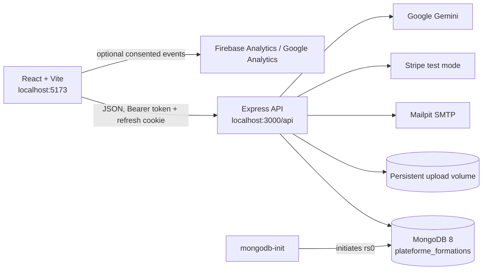

<p align="center"></p>

# High Skills Academy

> A web platform for discovering, delivering, managing, and validating professional training.

   

High Skills Academy is a French-language training platform with a public catalogue and role-based workspaces for learners, trainers, and administrators. It supports self-paced and in-person training, paid enrollment, protected content, progress and attendance, evaluations, certificates, feedback, costs, dashboards, and AI-assisted experiences.

## Features

| Area              | Current capabilities                                                                                                                  |
| ----------------- | ------------------------------------------------------------------------------------------------------------------------------------- |
| Public website    | Published-training catalogue and details, available sessions, FAQ, contact form, registration and password recovery                   |
| Identity          | Learner registration; authenticated Learner, Trainer, and Admin workspaces; profile and password management                           |
| Training delivery | Categories, draft/published/archived training, ownership, modules, lessons, protected resources, online and in-person delivery        |
| Learning          | Paid enrollment, lesson progress, sessions, attendance, evaluations, automatic grading, certificates, immutable satisfaction feedback |
| Reporting         | Stripe test-mode checkout and webhook fulfillment, invoices, trainer/training costs, recommendations, dashboards                      |
| AI                | Course tutor, public website concierge, and trainer-controlled Gemini draft-question generation                                       |
| Measurement       | Optional consent-based Firebase Analytics for page views and recommendations                                                          |

## Architecture

This is a **modular monolith**, not a microservices system. The React client and Express API are separate processes, while the backend keeps business domains in modules within one application. Docker services supply local infrastructure; they are not independent business services.



The browser calls `/api`; the API authorizes requests, owns access control and external-service credentials, and reads or writes MongoDB. Gemini and Stripe secret keys never reach the browser.

| Layer          | Implementation                                                 |
| -------------- | -------------------------------------------------------------- |
| Web client     | React 19, TypeScript, Vite, React Router, React Hook Form, Zod |
| API            | Node.js, Express 5, TypeScript, Mongoose, Zod                  |
| Database       | MongoDB 8, single-node replica set `rs0`                       |
| Local services | Docker Compose and Mailpit                                     |
| Payments       | Stripe Checkout and signed webhooks                            |
| AI             | Google Gen AI SDK / Gemini                                     |
| Analytics      | Firebase Analytics SDK                                         |

## Getting started on a new PC

### Prerequisites

| Required software                                                 | Reason                                                           |
| ----------------------------------------------------------------- | ---------------------------------------------------------------- |
| [Git](https://git-scm.com/downloads)                              | Clone the repository                                             |
| Node.js **24+** and npm **11+**                                   | Install and run the project; it pins `npm@11.17.0`               |
| [Docker Desktop](https://www.docker.com/products/docker-desktop/) | Run the API, MongoDB, database bootstrap, and local mail service |

Optional: [MongoDB Compass](https://www.mongodb.com/products/tools/compass) to inspect data; a Firebase project for analytics; Stripe test credentials for real checkout; and a Google AI Studio API key for Gemini functionality.

### 1. Clone and install

```powershell
git clone https://github.com/adambsr/Plateforme_Formations.git
Set-Location Plateforme_Formations
npm ci
```

### 2. Create configuration files

Local `.env` files are ignored by Git. Create them from the committed templates:

```powershell
Copy-Item .env.example .env
Copy-Item Web/backend/.env.example Web/backend/.env
Copy-Item Web/frontend/.env.example Web/frontend/.env
```

Edit them using the [environment reference](#environment-variables). Placeholder Stripe and Gemini values allow services to start, but cannot complete real payment or AI requests.

### 3. Start API and local services

```powershell
npm run docker:up
```

This builds the backend when necessary and waits for MongoDB and API health checks. MongoDB replica-set setup and backend indexes happen automatically.

### 4. Create the initial administrator

After Docker is healthy, use the administrator credentials configured in `Web/backend/.env`:

```powershell
npm run seed:admin
```

This is idempotent: it only creates the configured administrator when no administrator exists.

### 5. Start the web client

In a second terminal at the repository root:

```powershell
npm run dev:frontend
```

Open <http://localhost:5173>. The default API is <http://localhost:3000/api>.

### 6. Verify

| Check         | Address or command                 | Expected result                                                   |
| ------------- | ---------------------------------- | ----------------------------------------------------------------- |
| API health    | <http://localhost:3000/api/health> | `status: "ok"`, database `up`                                     |
| API reference | <http://localhost:3000/api/docs>   | Swagger UI                                                        |
| Web app       | <http://localhost:5173>            | Public High Skills Academy site                                   |
| Local mail    | <http://localhost:8025>            | Mailpit inbox                                                     |
| Containers    | `docker compose ps`                | `backend`, `mongodb`, `mailpit` running; `mongodb-init` completed |

The repository also provides `npm run dev:backend`. It requires `Web/backend/.env` to point to reachable MongoDB and SMTP services. The Compose path above is the supported local arrangement for normal development.

## Environment variables

Never commit copied `.env` files. Do not put server secrets in `VITE_` variables: Vite exposes them to the browser bundle. Restart Vite after frontend changes; rerun `npm run docker:up` after root Docker configuration changes.

| File                | Read by                                                     | Role                                                                    |
| ------------------- | ----------------------------------------------------------- | ----------------------------------------------------------------------- |
| `.env`              | Docker Compose; loaded first for a directly started backend | Stripe and Gemini Compose overrides                                     |
| `Web/backend/.env`  | Backend scripts and direct backend startup                  | Server, database, auth, SMTP, payment, uploads, Gemini, centre identity |
| `Web/frontend/.env` | Vite client                                                 | Public API/contact display and Firebase Analytics                       |

### Root `.env` — Docker Compose

All have safe Compose defaults; real credentials are needed to use their integrations.

| Variable                | Used by        | Purpose                             | Required?                          |
| ----------------------- | -------------- | ----------------------------------- | ---------------------------------- |
| `STRIPE_SECRET_KEY`     | Docker backend | Stripe test secret key              | For real checkout                  |
| `STRIPE_WEBHOOK_SECRET` | Docker backend | Webhook signature secret            | For verified webhook delivery      |
| `STRIPE_SUCCESS_URL`    | Docker backend | Checkout success return URL         | Defaults locally                   |
| `STRIPE_CANCEL_URL`     | Docker backend | Checkout cancel return URL          | Defaults locally                   |
| `AI_API_KEY`            | Docker backend | Server-side Gemini API key          | For Gemini functionality           |
| `AI_MODEL`              | Docker backend | Gemini fallback/evaluation model    | No; defaults to `gemini-3.7-flash` |
| `AI_MAX_CONTEXT_CHARS`  | Docker backend | Evaluation-generation context limit | No; defaults to `100000`           |

### `Web/backend/.env` — API

| Variable                                                     | Used by             | Purpose                                                     | Required?                                           |
| ------------------------------------------------------------ | ------------------- | ----------------------------------------------------------- | --------------------------------------------------- |
| `NODE_ENV`                                                   | API                 | `development`, `test`, or `production`                      | Yes                                                 |
| `PORT`                                                       | API                 | HTTP listener port                                          | No; `3000` default                                  |
| `MONGODB_URI`                                                | API / seed commands | MongoDB connection string                                   | Yes                                                 |
| `WEB_APP_URL`                                                | API                 | Web origin for application links                            | Yes                                                 |
| `CORS_ORIGINS`                                               | API                 | Comma-separated allowed browser origins                     | Yes                                                 |
| `TZ`                                                         | API                 | Must be `UTC`                                               | No; `UTC` default                                   |
| `LOG_LEVEL`                                                  | API                 | Pino log level                                              | No; `info` default                                  |
| `JWT_ACCESS_SECRET`                                          | API                 | Access-token signing secret (32+ characters)                | Yes                                                 |
| `JWT_ACCESS_TTL_MINUTES`                                     | API                 | Access-token lifetime                                       | No; `15` default                                    |
| `REFRESH_TOKEN_TTL_DAYS`                                     | API                 | Refresh-session lifetime                                    | No; `7` default                                     |
| `PASSWORD_RESET_TTL_MINUTES`                                 | API                 | Reset-token lifetime                                        | No; `30` default                                    |
| `INITIAL_ADMIN_EMAIL`                                        | `seed:admin`        | Initial administrator email                                 | Only for the seed                                   |
| `INITIAL_ADMIN_PASSWORD`                                     | `seed:admin`        | Initial administrator password (12+ characters)             | Only for the seed                                   |
| `SMTP_HOST`, `SMTP_PORT`, `SMTP_SECURE`                      | API                 | SMTP endpoint and implicit-TLS setting                      | Yes                                                 |
| `SMTP_USER`, `SMTP_PASSWORD`                                 | API                 | SMTP credentials                                            | Optional pair; set both or neither                  |
| `SMTP_FROM`                                                  | API                 | Sender identity for reset/contact mail                      | Yes                                                 |
| `STRIPE_SECRET_KEY`                                          | API                 | Stripe test key (`sk_test_…`)                               | Yes; real key for payments                          |
| `STRIPE_WEBHOOK_SECRET`                                      | API                 | Webhook secret (`whsec_…`)                                  | Yes; real secret for verification                   |
| `STRIPE_SUCCESS_URL`, `STRIPE_CANCEL_URL`                    | API                 | Checkout return URLs                                        | Yes                                                 |
| `UPLOAD_DIR`                                                 | API                 | Protected uploads and generated documents directory         | Yes                                                 |
| `MAX_UPLOAD_SIZE_MB`                                         | API                 | Upload-size limit                                           | No; `20` default                                    |
| `AI_API_KEY`                                                 | API                 | Gemini API key                                              | Configuration requires a value; real key for Gemini |
| `AI_MODEL`                                                   | API                 | Gemini evaluation/configured fallback model                 | Yes                                                 |
| `AI_BASE_URL`                                                | API                 | Optional compatible Gemini base URL                         | No                                                  |
| `AI_MAX_CONTEXT_CHARS`                                       | API                 | Evaluation context limit (1,000–1,000,000)                  | No; `100000` default                                |
| `CENTER_NAME`, `CENTER_ADDRESS`, `CENTER_EMAIL`              | API                 | Centre identity used in application documents/contact       | Yes                                                 |
| `CENTER_PHONE`, `CENTER_REGISTRATION_ID`, `CENTER_LOGO_PATH` | API                 | Optional centre phone, registration ID, local document logo | No                                                  |

### `Web/frontend/.env` — browser-safe values

| Variable                                                                             | Used by          | Purpose                                                   | Required?                                   |
| ------------------------------------------------------------------------------------ | ---------------- | --------------------------------------------------------- | ------------------------------------------- |
| `VITE_API_BASE_URL`                                                                  | Web client       | API base URL                                              | No; defaults to `http://localhost:3000/api` |
| `VITE_CENTER_NAME`                                                                   | Web client       | Reserved; currently not read by the client                | No                                          |
| `VITE_CENTER_ADDRESS`, `VITE_CENTER_EMAIL`, `VITE_CENTER_PHONE`, `VITE_CENTER_HOURS` | Contact page     | Public contact display                                    | No; the page has fallbacks                  |
| `VITE_FIREBASE_ANALYTICS_ENABLED`                                                    | Analytics        | Enables Analytics only when exactly `true`                | No; disabled by default                     |
| `VITE_FIREBASE_ANALYTICS_DEBUG`                                                      | Analytics        | Adds `debug_mode` for DebugView                           | No; validation only                         |
| `VITE_FIREBASE_API_KEY`                                                              | Analytics        | Firebase web app API key                                  | When Analytics is enabled                   |
| `VITE_FIREBASE_AUTH_DOMAIN`                                                          | Analytics config | Firebase auth-domain configuration value                  | Optional for current Analytics-only use     |
| `VITE_FIREBASE_PROJECT_ID`, `VITE_FIREBASE_APP_ID`, `VITE_FIREBASE_MEASUREMENT_ID`   | Analytics        | Firebase project, web-app, and GA measurement identifiers | When Analytics is enabled                   |

## Docker and local services

The client is not containerized in the current development setup. `docker-compose.yml` runs these services:

| Service        | Purpose            | What it does                                                                                         | Access                                 |
| -------------- | ------------------ | ---------------------------------------------------------------------------------------------------- | -------------------------------------- |
| `backend`      | API                | Builds/serves the API, waits for database initialization, owns protected uploads, has a health check | <http://localhost:3000/api> (loopback) |
| `mongodb`      | Database           | MongoDB 8 with `rs0`, health check, and persistent database volume                                   | `127.0.0.1:27017` (loopback)           |
| `mongodb-init` | Database bootstrap | Safely initiates `rs0` with `mongodb:27017`, then waits for a writable primary                       | No host port; completes and exits      |
| `mailpit`      | Local mail capture | Receives backend SMTP and exposes a browser inbox                                                    | <http://localhost:8025> (loopback)     |

`mongodb-init` is required because the application relies on a transaction-capable replica set. On later starts it verifies the existing configuration instead of recreating it.

| Volume            | Contents                                  |
| ----------------- | ----------------------------------------- |
| `mongodb_data`    | MongoDB files                             |
| `backend_uploads` | Protected uploads and generated documents |

```powershell
# Build/start and wait for health
npm run docker:up

# Follow logs
npm run docker:logs

# Inspect status or restart the API
docker compose ps
docker compose restart backend

# Stop services; named volumes remain
npm run docker:down
```

## Database and MongoDB Compass

MongoDB runs locally through the `mongodb` service. The development database is `plateforme_formations`; use this connection string in MongoDB Compass:

```text
mongodb://localhost:27017/plateforme_formations?replicaSet=rs0&directConnection=true
```

Install Compass, start the stack, choose **New Connection**, paste the URI, and select `plateforme_formations` in the sidebar. Backend startup creates Mongoose indexes; there is no separate migration command. Direct database edits can bypass API business rules, so use them carefully.

## Web application

`Web/frontend` is a React single-page application. Its API client uses `VITE_API_BASE_URL`, sends credentials for refresh-cookie handling, and sends an in-memory Bearer access token on authenticated calls. `Web/backend` validates configuration and DTOs, applies role/ownership checks, and exposes OpenAPI at `/api/docs`.

| Area             | Important routes                                                                                                         |
| ---------------- | ------------------------------------------------------------------------------------------------------------------------ |
| Public           | `/`, `/catalogue`, `/trainings/:id`, `/about`, `/faq`, `/contact`                                                        |
| Account          | `/login`, `/register`, `/forgot-password`, `/reset-password`, `/change-password`                                         |
| Shared workspace | `/app/profile`, `/app/catalogue`, `/app/content/:trainingId`, `/app/attendance`, `/app/evaluations`, `/app/certificates` |
| Learner          | `/app/learner`, `/app/progress`, `/app/payments`                                                                         |
| Trainer          | `/app/trainings`, `/app/trainings/:trainingId/content`, `/app/sessions`, `/app/evaluations/new`, `/app/trainer`          |
| Administrator    | `/app/categories`, `/app/users`, `/app/dashboard`                                                                        |

## Firebase Analytics

The Firebase Web SDK is used **only for optional Firebase Analytics / Google Analytics**. The current implementation does not use Firebase Authentication, Firestore, Realtime Database, Storage, or Hosting.

Configuration lives in `Web/frontend/src/core/analytics/firebase.ts`. Analytics initializes only when it is enabled, the API key/project ID/app ID/measurement ID exist, the browser supports Analytics, and the visitor explicitly accepts the in-app banner. Consent is stored as `analytics-consent` in local storage; before consent, Firebase is not initialized and no events are queued.

| Event                       | Trigger                                                                                                    | Parameters                                                |
| --------------------------- | ---------------------------------------------------------------------------------------------------------- | --------------------------------------------------------- |
| `page_view`                 | Each client-side route after consent                                                                       | `page_location`, `page_path`, `page_title`                |
| `recommendation_impression` | First display of a learner-dashboard recommendation                                                        | `training_id`, `training_category`, `recommendation_rank` |
| `recommendation_click`      | Learner opens a recommendation                                                                             | `training_id`, `training_category`, `recommendation_rank` |
| `recommendation_enrollment` | Backend-confirmed enrollment attributed to a recommendation clicked in the same session (up to seven days) | `training_id`, `training_category`, `recommendation_rank` |

Attribution is held in session storage and removed after conversion. Development mode logs initialization and queued events to the browser console. Set `VITE_FIREBASE_ANALYTICS_DEBUG=true` while validating in **Firebase Console → Analytics → DebugView**; it adds `debug_mode`. Consent refusal, blockers, or unsupported browsers can prevent events from sending.

## AI features

Gemini calls originate only in the backend through `AI_API_KEY`. The API asks for structured JSON and validates responses before returning them.

### AI Tutor — training content

The **Tuteur IA de la formation** appears for an enrolled learner in `/app/content/:trainingId`. It can answer course questions; simplify concepts; give grounded examples; make short practice questions; summarize relevant material; and prepare revision aids based on the conversation. It returns clickable lesson citations and up to three follow-up questions.

- `POST /api/trainings/:id/tutor/messages` requires an authenticated Learner, changed password, and training enrollment.
- The backend ranks active, non-archived course lessons and retrieves no more than **five** relevant excerpts. A selected current lesson is boosted.
- Gemini receives only the learner message, up to **eight** recent conversation messages, and retrieved lesson text—not identity, payment, progress, certificate, evaluation, or other account data.
- Context is capped at the smaller of `AI_MAX_CONTEXT_CHARS` and **24,000 characters**. Messages/conversation entries are capped at 2,000 characters.
- A supported answer must cite supplied lesson IDs. Unauthorized, fabricated, or inconsistent citations are rejected. If sources are insufficient, Gemini is instructed to return an ungrounded answer with no citations.
- Chat history is held in the current browser UI; it is not stored by the tutor service. The in-memory IP limiter permits **30 requests per 15 minutes**.
- Gemini uses `gemini-3.1-flash-lite` first, has a 15-second timeout and 1,600-token response cap, and can fall back to the configured model after eligible transient errors.

### Public AI concierge

Signed-out visitors see a floating bottom-right **Assistant HSA** widget. It has a welcome message, starter/follow-up questions, responsive layout, clickable public sources/actions, and a Gemini/privacy disclosure. It disappears after login.

It is a public website concierge—not a course tutor. It explains the platform, public training information, prices and enrollment, registration and payment flow, navigation, and general public questions. It can recommend published training or registration when appropriate, and provides a Contact action if it cannot support an answer.

- Anonymous endpoint: `POST /api/public/concierge/messages`.
- Context contains curated public pages plus selected fields from up to 100 `PUBLISHED` trainings. It cannot access users, enrollments, payments, progress, lessons, evaluations, certificates, credentials, or private content.
- It ranks up to five pages and five matching trainings; at most eight sources and **12,000 context characters** are sent. Contact is retained as a fallback.
- URLs are resolved server-side from source IDs. Gemini cannot invent protected/external links; invalid citations/actions are rejected.
- The system instruction treats visitor text, conversation, and sources as untrusted data; it rejects prompt injection and private-data claims.
- Input is capped at 1,000 characters, recent conversation at four messages, response at 3,000 characters, citations at five, actions at three, and suggestions at three.
- A hidden `website` honeypot avoids Gemini calls for bot submissions. The in-memory IP limiter permits **10 requests per 15 minutes**; conversations are not stored server-side.
- Gemini uses `gemini-3.1-flash-lite` first, 15-second timeouts, a 1,200-token cap, and configured-model fallback.

### Trainer AI question generation

Trainers can create draft objective questions through `POST /api/evaluations/:id/generate-ai`. The backend builds a bounded training-only context from active modules, lessons, and extractable local PDF, DOCX, PPTX, or TXT resources. Gemini returns schema-constrained questions that are validated and imported as drafts; the trainer must review, edit, and explicitly publish. AI cannot publish an evaluation or designate it certifying. This flow uses `AI_MAX_CONTEXT_CHARS`, `AI_MODEL`, and an 8,192-token output cap; it does not crawl URLs or use OCR.

## External services

| Service                     | Use                                          | Configuration                                                                         |
| --------------------------- | -------------------------------------------- | ------------------------------------------------------------------------------------- |
| Google Gemini               | Tutor, concierge, trainer question drafts    | Backend/root `AI_API_KEY`, `AI_MODEL`, optional `AI_BASE_URL`, `AI_MAX_CONTEXT_CHARS` |
| Stripe                      | Test Checkout and signed webhook fulfillment | Backend/root test key, webhook secret, return URLs                                    |
| Firebase / Google Analytics | Optional consent-based measurement           | `VITE_FIREBASE_*` in `Web/frontend/.env`                                              |
| Mailpit                     | Local password-reset/contact email capture   | Supplied by Compose; Docker backend uses its internal SMTP endpoint                   |

## Useful commands

Run from the repository root.

| Task                         | Command                          |
| ---------------------------- | -------------------------------- |
| Install locked dependencies  | `npm ci`                         |
| Start Docker services/API    | `npm run docker:up`              |
| Stop services                | `npm run docker:down`            |
| Follow logs                  | `npm run docker:logs`            |
| Show service status          | `docker compose ps`              |
| Restart API container        | `docker compose restart backend` |
| Start web server             | `npm run dev:frontend`           |
| Start backend watcher        | `npm run dev:backend`            |
| Create initial administrator | `npm run seed:admin`             |
| Build web and backend        | `npm run build`                  |
| Render Compose configuration | `npm run docker:config`          |

The repository also has a development demonstration-data seed that deliberately clears and recreates the local database. It is not part of normal setup; review its safeguards before use.

## Project structure

```text
.
├── docker-compose.yml                 # Local API, MongoDB, bootstrap, Mailpit
├── .env.example                       # Docker Stripe/Gemini template
├── Web/
│   ├── backend/
│   │   ├── src/
│   │   │   ├── modules/               # Business modules and routes
│   │   │   ├── infrastructure/        # DB, files, PDF, mail, Stripe, OpenAPI
│   │   │   ├── middleware/            # Authentication and request limiting
│   │   │   └── scripts/               # Initial-admin and development data tools
│   │   ├── docker/init-replica-set.js
│   │   ├── .env.example
│   │   └── Dockerfile
│   └── frontend/
│       ├── src/
│       │   ├── app/                   # Routes, layouts, guards
│       │   ├── core/analytics/        # Firebase consent and tracking
│       │   ├── core/auth/             # Browser authentication client
│       │   ├── features/              # Pages, workspaces, AI UI
│       │   └── shared/                # Reusable UI and styles
│       ├── .env.example
│       └── vite.config.ts
├── HSA_LOGO.png
└── package.json                        # Workspace scripts and engines
```

## Local notes

- Docker ports are bound to loopback interfaces and the supplied stack is intended for local use.
- `/api/health` reports a degraded response when MongoDB is unavailable.
- Protected files and generated PDFs live in the upload volume and are served through authorized API routes, not public static URLs.
